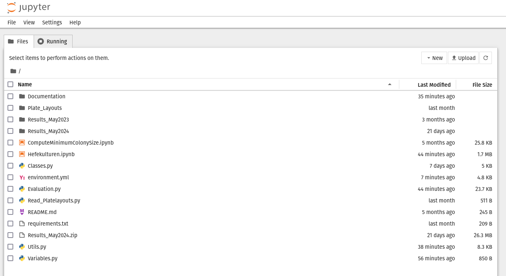

# User Guide

## Preparing Data


Before you are able to use the program, you need to prepare the images of the experiment and reference plates. 
To do so you need to crop out the center of the plates such that only the colonies are shown. See examples below. 


Additionally, you need to define the layout within the filename. This means, you need to add `A_`, `B_`, `C_` according to the layout to file name.
 


## Getting Started

1. Navigate into the directory where you placed the code. Open a terminal and type:
    
    ```bash 
    cd your-directory-of-choice
    ```

    Press `Enter`.

2. Start the conda environment by typing:

    ```bash
    conda activate hefekulturen    
    ```

    

3. Start the program by using jupyter notebook. Therefore type and press `Enter`:

    ```bash 
    jupyter notebook
    ```

    This will open a browser window. It shows the current directory. You can now click on the `Hefekulturen.ipynb`
    

Finally, this opens the program in a new browser tab. It should look similar to this:


We can now start using the program: 
The code is organized in a top to bottom fashion using cells. We can differentiate between *Code* and *Text* cells. For running the program, we need to run the *Code* cells in an iterative fashion. 
To do so, click inside the first cell you like to run, then press the arrow on the top of the page to execute the code.  

When you execute the third *Code* cell, there will appear multiple tabs below this cell, as well as a `Select` button.


Go through each tab and click `Select`. This will show a File Chooser, from which you can choose the reference plate and experiment plate accordingly. In the last tab you can chose the directory where you like to save the results to. 


Once the File was successfully selected, it should be displayed in the according tab: 

 

Make sure you select the correct files in each tab!

Now, all you need to do is execute the remaining *Code* cells in their provided order. 
Finally, in Code cell [12], the evaluation takes place. When quadruples are marked as invalid, a warning will be shown, as well as the reson for their invalidity. 


Additionally, a qualitative image of the evaluation in shown. 

**Exp1** evaluates the growth of the smallest normalized colony within the bigger quadruple. If it is an outlier defined by $1.5 \times IQR$, it is marked as significant. All other quadruples on the plates are taken as a reference. 

**Exp2** evaluates the significant difference of quadruple in row A with quadruple in row B. This is done by the use of statistical tests (like t-test). We assume significance, if the p-value is smaller than 0.01. 

Finally, the intersection of both experiments is considered. 

Green marks significant outcomes of the experiments. Red marks invalid quadruples, which can be due to multiple reasons. For details please see `./Documentation/Implementation-Details.md`


If you then execute the very last code cell [13] your results will be saved into the save directory. 
The results include an excel table as well as the qualitative results. 
After finishing, it will automatically open the systems file explorer to show the saved results for further inspections. 

 


