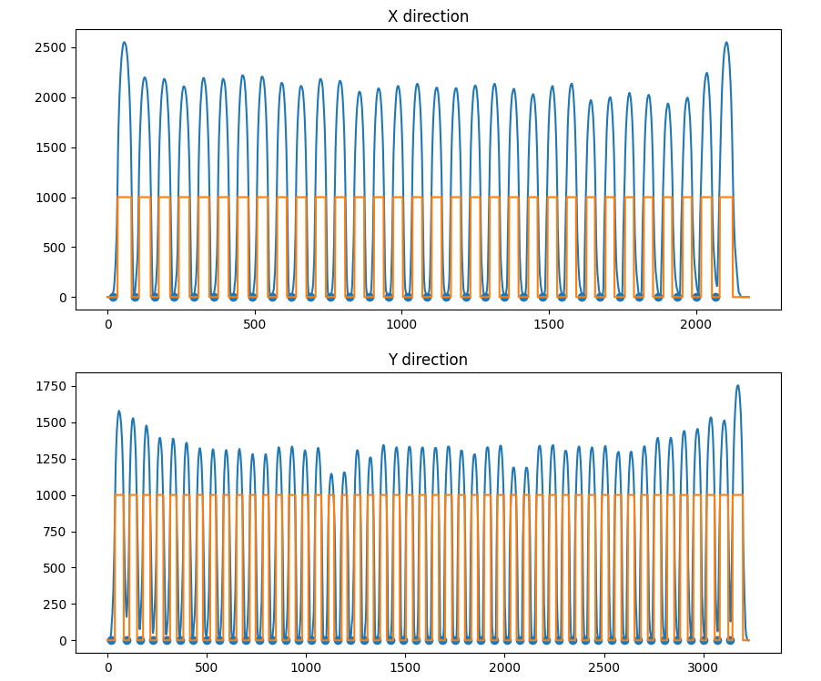
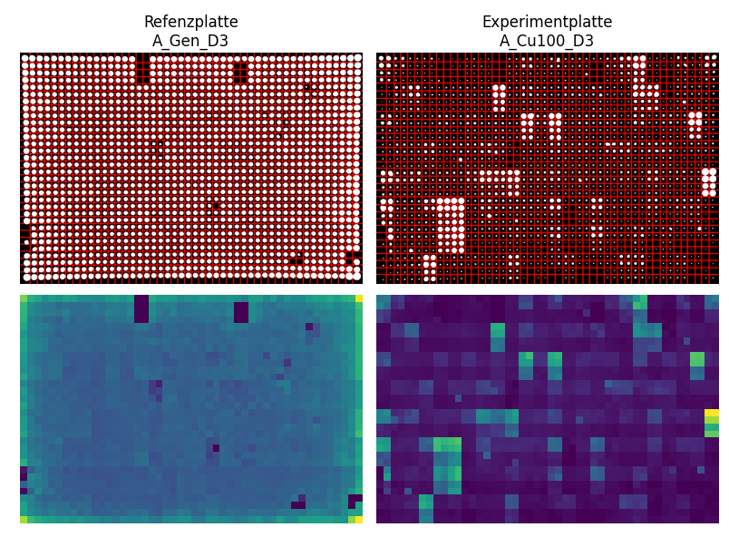

# Step-By-Step Guide

## 1. Choose Files To Evaluate
This is the only section which requires user input. 
Within this section the user needs to choose the `reference plate`, `experiment plate` and `save directory`. 

## 2. Open and Preprocess Images
### 2.1 Open Images as Binary
The `reference plate` as well as the `experiment plate` are loaded. 
1. The image is loaded as grayscale
2. It is resized to (3230, 2180) to make experiments comparable
3. The image values are normalized to a range $\in[0,255]$
4. We use Otsu thresholding to binarize the image
5. Finally, we apply an opening operation with a $7 \times 7$ kernel to remove small bright artefacts (Opening can remove small bright spots (i.e. “salt”) and connect small dark cracks.)

### 2.2 Compute Colony Sizes
In this step, we compute a grid, which we can put on top of the image. Each cell of the grid contains a single colony. TO compute the grid we follow these steps: 
1. Computation of the sum of the image along the image rows
2. Compute the local minima of the resulting function
3. Repeat step 1. and 2. along image columns

4. We check, if we were able to detect the correct number of rows and columns 
5. If this is not the case we place a grid, which we define based on the width/height of the image and the expected columns/rows. This can lead to small artefacts, which is why a `WARNING` is raised

Based on the grid we can compute the number of white pixels within a each grid cell to derive the colony size. 

## 3. Evaluate
Based on the computed colony sizes we are able to conduct the final evaluation.

### Preprocessing
1. Grouping and structuring of the colonies into Quadruples of row A and row B. 
2. For each colony we check, if its raw size is bigger than a predefined `MIN_COLONY_SIZE`. If this is the case, it is excluded from the evaluation and its quadruple is marked as `invalid`. A `WARNING` is raised: *"Missing values in quadrupel."*
3. We normalize the sizes by the reference plate. The size of a colony is hence defined as follows: $s_{col} = \frac{s_{exp}}{s_{ref}+\eta}$,  where $\eta = 1e^{-10}$ is used for numerical stability.
4. We check the reference plate for errors in growth. 
    1. We compute the root squared difference ($\sqrt{mean((x_i - y_i)^2)}$) between row A and B in a line (row) wise fashion
    2. We apply the grubbs outlier test (single iteration) for every AB-row on the plate. 
    3. Outliers regarding the root squared difference in a single AB-row are marked as `invalid`.

### Exp2: Differences in Growth between row A and B
For all quadruples with a sample size of 4 we conduct a statistical test by comparing the normalized sizes of quadruple A with quadruples of row B  
1. We test for equal variances using [Levenes](https://docs.scipy.org/doc/scipy/reference/generated/scipy.stats.levene.html) test
2. If Levene test fails (p-value < 0.01), we mark the quadruple as `invalid` and a `WARNING` is raised: *"Variances of row A and B are not equal. A comparison is not recommended."* 
3. We test for normality using [Shapiro](https://docs.scipy.org/doc/scipy/reference/generated/scipy.stats.shapiro.html) test. 
4. If Shapiro test fails (p-value < 0.01) for one of the quadruples, we cannot assume normality. We hence use the [wilcoxon](https://docs.scipy.org/doc/scipy/reference/generated/scipy.stats.wilcoxon.html) test and compute the Wilcoxon effect size (r). However, please note that this effect size is not directly comparable to the cohens d. The quadruple is hence marked as `invalid` and a `WARNING` is raised: *"Normality of the samples cannot be assumed. T-test is not applicable. We will apply wilcoxon test."*
5. For all remaining quadruples we use calculate the [t-test](https://docs.scipy.org/doc/scipy/reference/generated/scipy.stats.ttest_rel.html) on TWO RELATED samples of scores. We compute the effect size with Cohen's d.
6. We visualize the results of Exp2 using color coding of the effect sizes. We code by 3 percentiles (25,50,75) of all statistical tests with a p-value < 0.01. Invalid quadruples are marked in red.

### Exp1: Absolute Growth
This experiment evaluates the growth of the bigger normalized row (A or B) in comparison to all other bigger normalized rows (A or B) on the plate and marks outliers. 
1. We compute Exp1 by comparing the mean growth of the bigger quadruple (row A/B) with all others on the plate. We mark all quadruples which are outliers regarding $1.5 \times IQR$. 
2. We again color code the results similar to Exp2

### Combination Exp1 + Exp2
1. We compute the intersection of Exp1 and Exp2 by visualizing quadruples that are significant in both experiments. 
2. Finally, we sort the results to be saved in the Excel table. To do this, we first sort all entries which are significant in Exp1 and Exp2 by the effect size in Exp2. Next, we sort entries which are significant in Exp2 by their effect size. Then, we sort entries which are significant in Exp1 by their absolute size. Then, we sort entries which are neither significant in Exp1 nor in Exp2. Finally, we list all invalids.  

On the final step of the program, the system file manager is opened to show the result files. 

# Statistics in Exp2
What the p-value really tells us: https://www.ncbi.nlm.nih.gov/pmc/articles/PMC5665734/

### Computation of statistic significance (p-value)
The p-value tells you whether the observed difference between the groups is likely due to chance (i.e., whether the effect is statistically significant).

### Computation of effect size
Effect size tells you how meaningful the relationship between variables or the difference between groups is.
Cohen's d tells you how big the observed difference between the groups is in standardized units, providing insight into the practical significance of the effect.

**Wilcoxon effect size (r):** This effect size measure is used in non-parametric tests like the Wilcoxon signed-rank test or the Mann-Whitney U test. It measures the strength and direction of the relationship between two variables when the assumptions of parametric tests (such as normality of data) are not met. It's suitable for ordinal or ranked data.

**Cohen's d**:
Cohen's d measures the standardized difference between two means. It is used to quantify the effect size of the difference between two groups in a study.
It indicates the magnitude of the difference between two groups relative to the variability in the data.
Cohen's d is commonly used in hypothesis testing to determine the practical significance of the difference between groups.
It can be used for comparing means in various statistical tests, such as t-tests, ANOVAs, etc.
Cohen's d values typically range from 0 to 2 or more, where higher values indicate larger effect sizes.

In summary, while the p-value of a t-test informs you about the statistical significance of the observed difference, Cohen's d provides additional information about the magnitude of the difference, helping you assess the practical importance of the effect. Both are essential in interpreting the results of hypothesis testing comprehensively.